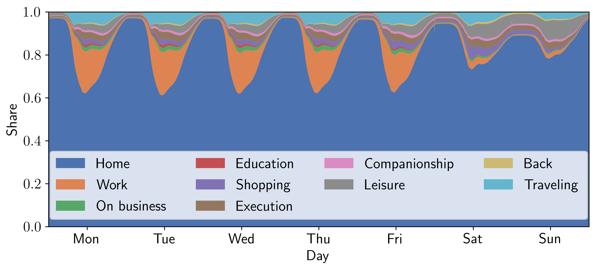
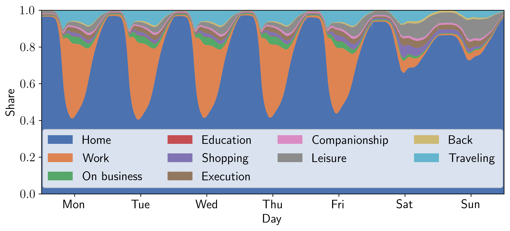
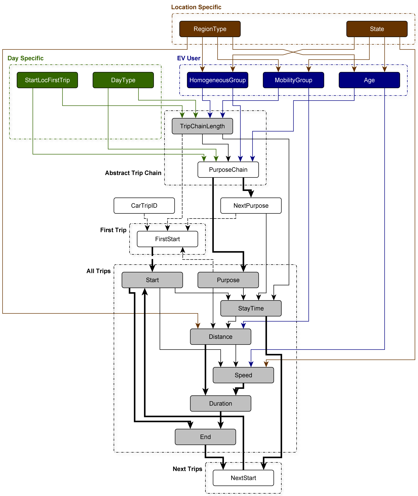

# EV Mobility Model
EV Mobility Model is a stochastic model of the mobility behavior of private electric vehicles.
It is based on the Mobility in Germany 2017 data, featuring over 1 million data points. 
It uses a directed acyclic graph with random variables on the nodes and conditional propability distributions on the edges to sample trip chains of realistic daily mobility behavior.

The model is a (**not tested and validated**) open-source Python reimplementation of the mobility model developed as part of this [PhD Thesis](https://opus4.kobv.de/opus4-fau/frontdoor/index/index/docId/17600) from [Computer Science 7](https://www.cs7.tf.fau.eu/) at [FAU Erlangen](https://www.fau.de/). 

**Cite this thesis:** *J. Schlund, Electric Vehicle Charging Flexibility for Ancillary Services in the German Electrical Power System, PhD Thesis, Friedrich-Alexander-University Erlangen Nürnberg, 2021*.

Bibtex: 

    @phdthesis{Schlund2021,
      author      = {Jonas Schlund},
      title       = {{Electric Vehicle Charging Flexibility for Ancillary Services in the German Electrical Power System}},
      pages       = {308},
      school      = {Friedrich-Alexander-Universit{\"a}t Erlangen-N{\"u}rnberg (FAU)},
      year        = {2021},
    }

## Assumptions
The model uses two major assumptions
- EVs are only adopted at mass scale if users do not have to change their behavior
- EVs mainly charge where they park

## Main Features
- The daily mobility activity is describes with individual trips between abstract locations (such as *Work*, *Business*, *Leisure*, *Home*, *Education*, *Shopping*,...)
- A trip chain describes the full mobility behavior over a day
- It includes all individual costrants of each trip (such as *arrival time*, *departure time*, *duration*, *speed*, *stay time*, *distance*, *purpose*)  
- It can represent patters of different user groups (*behaviorally homogeneous groups*, *mobility groups*, *age groups*) on different days (the different days of the week and holidays) and locations (different regional types from urban to rural and federal states)
- Due to the chosen graph structure it adheres the most important variable interdependencies
- It does not use magic rules and numbers

## Example Run
Just run model.py for an exemplary run to sample 200 trip chains with a fixed seed.

    python model.py 

## Exemplary Visualization
Resulting weekly behavior of a large fleet with average users. 

Resulting weekly behavior of a large fleet with working persons and car users. 

## Graph Structure
This visual description might help to understand how the variables are sampled. 

# Licence
The software is licensed under [MIT License](https://github.com/jsschl/ev_mobility_model/blob/main/LICENSE).
